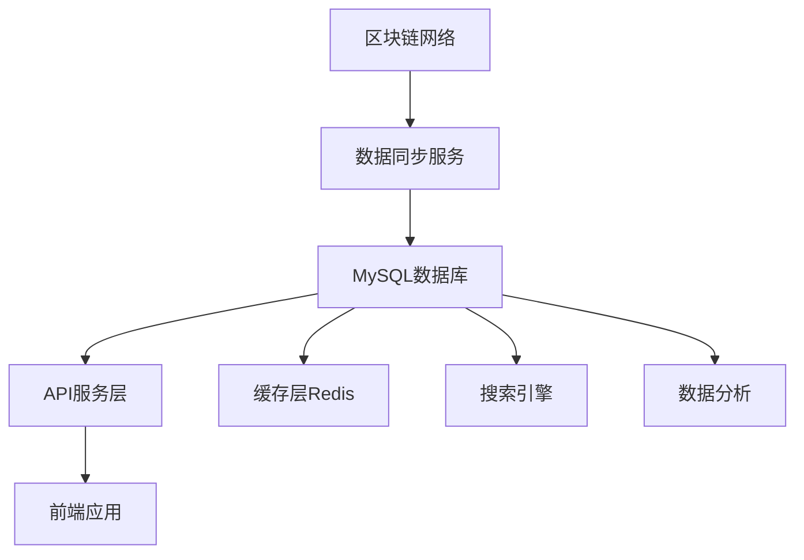

# 🗄️ Web3 MySQL 数据库使用指南

## 📋 基础概念

### Web3 应用数据存储挑战

Web3 应用面临独特的数据存储挑战：

1. **链上数据的不可变性** - 区块链数据一旦确认无法修改
2. **数据实时性要求** - 需要实时同步链上状态变化
3. **大量事务数据** - 每天数百万笔交易需要高效存储
4. **复杂查询需求** - 多维度数据分析和统计查询
5. **高可用性要求** - 7x24小时不间断服务

### MySQL 在 Web3 架构中的作用



- **主要数据存储**: 存储业务数据和索引数据
- **查询优化**: 提供快速的数据检索和分析
- **数据关系**: 维护复杂的数据关系和约束
- **事务支持**: 保证数据操作的ACID特性

## 🛠️ 环境准备

### 1. 依赖安装

```bash
# Go 依赖
go get gorm.io/gorm
go get gorm.io/driver/mysql
go get github.com/ethereum/go-ethereum
go get github.com/go-sql-driver/mysql
go get github.com/golang-migrate/migrate/v4

# 可选依赖
go get github.com/go-redis/redis/v8
go get go.uber.org/zap
go get github.com/prometheus/client_golang
```

### 2. MySQL 服务器配置

```ini
# /etc/mysql/my.cnf
[mysqld]
# 基础配置
port = 3306
bind-address = 0.0.0.0
character-set-server = utf8mb4
collation-server = utf8mb4_unicode_ci

# 性能优化
innodb_buffer_pool_size = 2G
innodb_log_file_size = 256M
innodb_flush_log_at_trx_commit = 1
sync_binlog = 1

# 连接配置
max_connections = 1000
max_connect_errors = 100000
wait_timeout = 28800
interactive_timeout = 28800

# 查询优化
query_cache_type = 1
query_cache_size = 256M
tmp_table_size = 256M
max_heap_table_size = 256M

# 日志配置
log-error = /var/log/mysql/error.log
slow_query_log = 1
slow_query_log_file = /var/log/mysql/slow.log
long_query_time = 2
```

### 3. 数据库初始化

```sql
-- 创建数据库
CREATE DATABASE awesome_trade_main 
CHARACTER SET utf8mb4 
COLLATE utf8mb4_unicode_ci;

CREATE DATABASE awesome_trade_blockchain 
CHARACTER SET utf8mb4 
COLLATE utf8mb4_unicode_ci;

-- 创建用户
CREATE USER 'web3_user'@'%' IDENTIFIED BY 'secure_password_123';
GRANT ALL PRIVILEGES ON awesome_trade_main.* TO 'web3_user'@'%';
GRANT ALL PRIVILEGES ON awesome_trade_blockchain.* TO 'web3_user'@'%';
FLUSH PRIVILEGES;
```

## 🏗️ 数据库架构设计

### Web3 核心概念解释

在开始数据库设计之前，让我们先理解 Web3 中的核心概念：

#### 🔗 基础概念

- **区块（Block）**: 包含多个交易的数据包，按时间顺序链接形成区块链
- **交易（Transaction）**: 从一个地址到另一个地址的操作，可能包含ETH转账或智能合约调用
- **地址（Address）**: 42字符的十六进制字符串（含0x前缀），标识钱包或智能合约
- **Gas**: 以太坊网络的"燃料费"，执行任何操作都需要消耗Gas
- **Wei**: 以太坊最小单位，1 ETH = 10^18 Wei

#### 🎯 关键理解

- **哈希（Hash）**: 数据的"指纹"，64位十六进制字符串，用于唯一标识
- **代币精度（Decimals）**: 代币支持的小数位数，如USDC为6位小数
- **事件日志（Event Log）**: 智能合约执行时发出的通知，记录重要操作
- **Nonce**: 地址发送交易的计数器，防止重复交易攻击

### 1. 核心数据模型

```go
package models

import (
    "time"
    "math/big"
    "gorm.io/gorm"
)

// 区块数据模型
type Block struct {
    // 基础标识字段
    ID           uint64    `gorm:"primaryKey;autoIncrement" json:"id"`           // 数据库自增主键，用于内部索引
    Number       uint64    `gorm:"uniqueIndex;not null" json:"number"`          // 区块号，区块链中的唯一标识，从0开始递增
    Hash         string    `gorm:"uniqueIndex;size:66;not null" json:"hash"`    // 区块哈希，64位十六进制+0x前缀，区块的唯一数字指纹
    ParentHash   string    `gorm:"index;size:66;not null" json:"parent_hash"`   // 父区块哈希，指向前一个区块，形成区块链
    
    // 时间和挖矿信息
    Timestamp    time.Time `gorm:"index;not null" json:"timestamp"`             // 区块生成时间戳，矿工打包区块的时间
    Miner        string    `gorm:"index;size:42;not null" json:"miner"`         // 挖矿者地址，成功挖出此区块的矿工/验证者地址
    
    // Gas 相关字段（以太坊交易费用机制）
    GasUsed      uint64    `gorm:"not null" json:"gas_used"`                    // 实际使用的Gas量，区块内所有交易消耗的Gas总和
    GasLimit     uint64    `gorm:"not null" json:"gas_limit"`                   // Gas限制，此区块允许消耗的最大Gas量
    
    // 区块属性
    Difficulty   string    `gorm:"type:varchar(100)" json:"difficulty"`         // 挖矿难度，PoW算法中的难度值，影响出块时间
    TotalTxs     int       `gorm:"default:0" json:"total_txs"`                  // 交易总数，此区块包含的交易数量
    
    // 系统时间戳
    CreatedAt    time.Time `gorm:"autoCreateTime" json:"created_at"`            // 数据库记录创建时间（非区块生成时间）
    UpdatedAt    time.Time `gorm:"autoUpdateTime" json:"updated_at"`            // 数据库记录最后更新时间
    
    // 关联关系
    Transactions []Transaction `gorm:"foreignKey:BlockID" json:"transactions,omitempty"`  // 一对多：一个区块包含多个交易
}

// 交易数据模型
type Transaction struct {
    // 基础标识字段
    ID               uint64    `gorm:"primaryKey;autoIncrement" json:"id"`               // 数据库自增主键，用于内部索引
    Hash             string    `gorm:"uniqueIndex;size:66;not null" json:"hash"`        // 交易哈希，交易的唯一标识符，由交易内容计算得出
    
    // 区块关联信息
    BlockID          uint64    `gorm:"index;not null" json:"block_id"`                  // 所属区块的数据库ID，外键关联到Block表
    BlockNumber      uint64    `gorm:"index;not null" json:"block_number"`              // 所属区块号，便于按区块号查询交易
    TransactionIndex uint      `gorm:"not null" json:"transaction_index"`               // 交易在区块中的索引位置，从0开始
    
    // 交易参与方
    FromAddress      string    `gorm:"index;size:42;not null" json:"from_address"`      // 发送方地址，交易的发起者，40位十六进制+0x前缀
    ToAddress        *string   `gorm:"index;size:42" json:"to_address"`                 // 接收方地址，交易的接收者，创建合约时为空
    
    // 交易金额和费用
    Value            string    `gorm:"type:decimal(78,0);not null" json:"value"`        // 转账金额，单位为wei（最小以太坊单位），支持大数
    GasPrice         uint64    `gorm:"not null" json:"gas_price"`                       // Gas价格，愿意为每单位Gas支付的费用，单位wei
    Gas              uint64    `gorm:"not null" json:"gas"`                             // Gas限制，交易发起者愿意消耗的最大Gas量
    GasUsed          *uint64   `json:"gas_used"`                                        // 实际消耗Gas，交易执行后才知道，可能为空
    
    // 交易状态
    Status           uint      `gorm:"not null;default:1" json:"status"`                // 交易状态：0=失败，1=成功
    Input            string    `gorm:"type:longtext" json:"input"`                      // 交易数据，智能合约调用的参数或创建合约的字节码
    Nonce            uint64    `gorm:"not null" json:"nonce"`                           // 防重放攻击的序号，发送方发起的交易计数器
    
    // 系统时间戳
    CreatedAt        time.Time `gorm:"autoCreateTime" json:"created_at"`                // 数据库记录创建时间
    UpdatedAt        time.Time `gorm:"autoUpdateTime" json:"updated_at"`                // 数据库记录最后更新时间
    
    // 关联关系
    Block            Block           `gorm:"foreignKey:BlockID" json:"block,omitempty"`           // 多对一：多个交易属于一个区块
    TokenTransfers   []TokenTransfer `gorm:"foreignKey:TransactionID" json:"token_transfers,omitempty"` // 一对多：一个交易可能产生多个代币转账
    EventLogs        []EventLog      `gorm:"foreignKey:TransactionID" json:"event_logs,omitempty"`       // 一对多：一个交易可能产生多个事件日志
}

// 代币转账模型 - 记录ERC20等代币的转账事件
type TokenTransfer struct {
    // 基础标识字段
    ID            uint64    `gorm:"primaryKey;autoIncrement" json:"id"`              // 数据库自增主键，用于内部索引
    TransactionID uint64    `gorm:"index;not null" json:"transaction_id"`           // 关联的交易ID，外键关联到Transaction表
    
    // 代币和参与方信息
    TokenAddress  string    `gorm:"index;size:42;not null" json:"token_address"`    // 代币合约地址，标识是哪种代币的转账
    FromAddress   string    `gorm:"index;size:42;not null" json:"from_address"`     // 代币发送方地址，谁发送了代币
    ToAddress     string    `gorm:"index;size:42;not null" json:"to_address"`       // 代币接收方地址，谁接收了代币
    
    // 转账详情
    Amount        string    `gorm:"type:decimal(78,0);not null" json:"amount"`      // 转账数量，原始单位（需要根据代币精度换算），支持大数
    LogIndex      uint      `gorm:"not null" json:"log_index"`                      // 事件日志在交易中的索引，用于排序和唯一标识
    
    // 系统时间戳
    CreatedAt     time.Time `gorm:"autoCreateTime" json:"created_at"`               // 数据库记录创建时间
    
    // 关联关系
    Transaction   Transaction `gorm:"foreignKey:TransactionID" json:"transaction,omitempty"`                  // 多对一：多个代币转账属于一个交易
    Token         Token       `gorm:"foreignKey:TokenAddress;references:Address" json:"token,omitempty"`     // 多对一：多个转账记录属于同一个代币
}

// 代币信息模型 - 存储代币合约的基本信息
type Token struct {
    // 基础标识字段
    ID          uint      `gorm:"primaryKey;autoIncrement" json:"id"`              // 数据库自增主键，用于内部索引
    Address     string    `gorm:"uniqueIndex;size:42;not null" json:"address"`    // 代币合约地址，代币的唯一标识符
    
    // 代币基本信息
    Name        string    `gorm:"size:100;not null" json:"name"`                  // 代币全名，如"Ethereum"、"USD Coin"
    Symbol      string    `gorm:"size:20;not null" json:"symbol"`                 // 代币符号，如"ETH"、"USDC"，用于显示
    Decimals    uint8     `gorm:"not null" json:"decimals"`                       // 小数位数，用于显示转换，如18表示支持18位小数
    
    // 代币统计信息
    TotalSupply string    `gorm:"type:decimal(78,0)" json:"total_supply"`         // 总发行量，代币的总供应量，支持大数
    
    // 代币属性
    TokenType   string    `gorm:"size:20;default:'ERC20'" json:"token_type"`      // 代币类型，如"ERC20"、"ERC721"、"ERC1155"
    IsVerified  bool      `gorm:"default:false" json:"is_verified"`               // 是否已验证，标识代币是否经过官方验证
    
    // 系统时间戳
    CreatedAt   time.Time `gorm:"autoCreateTime" json:"created_at"`               // 数据库记录创建时间
    UpdatedAt   time.Time `gorm:"autoUpdateTime" json:"updated_at"`               // 数据库记录最后更新时间
}

// 事件日志模型 - 记录智能合约发出的事件日志
type EventLog struct {
    // 基础标识字段
    ID            uint64    `gorm:"primaryKey;autoIncrement" json:"id"`           // 数据库自增主键，用于内部索引
    TransactionID uint64    `gorm:"index;not null" json:"transaction_id"`        // 关联的交易ID，外键关联到Transaction表
    
    // 事件信息
    Address       string    `gorm:"index;size:42;not null" json:"address"`       // 发出事件的合约地址，标识事件来源
    Topics        string    `gorm:"type:json" json:"topics"`                     // 事件主题，JSON格式存储，用于事件过滤和索引
    Data          string    `gorm:"type:longtext" json:"data"`                   // 事件数据，十六进制编码的事件参数数据
    LogIndex      uint      `gorm:"not null" json:"log_index"`                   // 日志在交易中的索引，用于排序和唯一标识
    
    // 系统时间戳
    CreatedAt     time.Time `gorm:"autoCreateTime" json:"created_at"`            // 数据库记录创建时间
    
    // 关联关系
    Transaction   Transaction `gorm:"foreignKey:TransactionID" json:"transaction,omitempty"`  // 多对一：多个事件日志属于一个交易
}

// 钱包地址模型 - 记录所有出现过的地址信息和统计数据
type Wallet struct {
    // 基础标识字段
    ID               uint64    `gorm:"primaryKey;autoIncrement" json:"id"`              // 数据库自增主键，用于内部索引
    Address          string    `gorm:"uniqueIndex;size:42;not null" json:"address"`    // 钱包地址，40位十六进制+0x前缀，唯一标识
    
    // 时间统计
    FirstSeenAt      time.Time `gorm:"not null" json:"first_seen_at"`                  // 首次出现时间，地址第一次在链上出现的时间
    LastActivityAt   time.Time `gorm:"index;not null" json:"last_activity_at"`         // 最后活跃时间，最近一次交易的时间，用于活跃度分析
    
    // 活跃度统计
    TransactionCount uint64    `gorm:"default:0" json:"transaction_count"`             // 交易计数，该地址参与的总交易数量
    BalanceETH       string    `gorm:"type:decimal(78,18);default:0" json:"balance_eth"` // ETH余额，当前ETH余额，单位ETH，支持18位小数
    
    // 地址类型
    IsContract       bool      `gorm:"default:false" json:"is_contract"`               // 是否为合约，true=智能合约地址，false=普通钱包地址
    ContractName     *string   `gorm:"size:100" json:"contract_name"`                  // 合约名称，如果是合约地址且已知名称，存储合约名称
    
    // 系统时间戳
    CreatedAt        time.Time `gorm:"autoCreateTime" json:"created_at"`               // 数据库记录创建时间
    UpdatedAt        time.Time `gorm:"autoUpdateTime" json:"updated_at"`               // 数据库记录最后更新时间
}

// DeFi 协议模型 - 记录去中心化金融协议的信息
type DeFiProtocol struct {
    // 基础标识字段
    ID              uint      `gorm:"primaryKey;autoIncrement" json:"id"`              // 数据库自增主键，用于内部索引
    Name            string    `gorm:"size:100;not null" json:"name"`                  // 协议名称，如"Uniswap"、"Aave"、"Compound"
    ContractAddress string    `gorm:"uniqueIndex;size:42;not null" json:"contract_address"` // 主合约地址，协议的核心合约地址
    
    // 协议分类
    ProtocolType    string    `gorm:"size:20;not null" json:"protocol_type"`          // 协议类型：DEX（交易所）、LENDING（借贷）、YIELD（收益农场）等
    ChainID         uint      `gorm:"not null" json:"chain_id"`                       // 区块链网络ID，1=以太坊主网，56=BSC，137=Polygon等
    Version         string    `gorm:"size:20" json:"version"`                         // 协议版本，如"V2"、"V3"，用于区分同一协议的不同版本
    
    // 协议状态
    IsActive        bool      `gorm:"default:true" json:"is_active"`                  // 是否活跃，标识协议是否仍在运行
    TVL             string    `gorm:"type:decimal(78,2)" json:"tvl"`                  // 总锁仓价值（Total Value Locked），衡量协议规模，单位USD
    
    // 系统时间戳
    CreatedAt       time.Time `gorm:"autoCreateTime" json:"created_at"`               // 数据库记录创建时间
    UpdatedAt       time.Time `gorm:"autoUpdateTime" json:"updated_at"`               // 数据库记录最后更新时间
}
```

### 📊 数据表关系和应用场景详解

#### 表关系图

```text
区块表 (blocks)
    ↓ 一对多
交易表 (transactions)
    ↓ 一对多
├── 代币转账表 (token_transfers)  →  代币信息表 (tokens)
└── 事件日志表 (event_logs)

钱包地址表 (wallets) ← 通过地址关联 → 所有其他表
DeFi协议表 (defi_protocols) ← 独立管理协议信息
```

#### 实际应用场景举例

#### 🔍 场景1：查询某个地址的所有交易

```sql
-- 查询地址 0x123... 的所有交易记录
SELECT t.*, b.timestamp 
FROM transactions t 
JOIN blocks b ON t.block_id = b.id 
WHERE t.from_address = '0x123...' OR t.to_address = '0x123...'
ORDER BY b.number DESC;
```

#### 💰 场景2：查询某个代币的转账记录

```sql
-- 查询 USDC 代币的转账记录
SELECT tt.*, tk.symbol, tk.decimals
FROM token_transfers tt
JOIN tokens tk ON tt.token_address = tk.address
WHERE tk.symbol = 'USDC'
LIMIT 100;
```

#### 📈 场景3：统计钱包活跃度

```sql
-- 更新钱包的交易计数和最后活跃时间
UPDATE wallets w
SET 
    transaction_count = (
        SELECT COUNT(*) FROM transactions t 
        WHERE t.from_address = w.address OR t.to_address = w.address
    ),
    last_activity_at = (
        SELECT MAX(b.timestamp) FROM transactions t
        JOIN blocks b ON t.block_id = b.id
        WHERE t.from_address = w.address OR t.to_address = w.address
    )
WHERE w.address = '0x123...';
```

#### 数据大小预估（基于以太坊主网）

| 表名 | 每日新增记录 | 单条记录大小 | 年增长量 | 存储建议 |
|------|-------------|-------------|----------|----------|
| blocks | ~7,200 | ~200B | ~500MB | 按月分区 |
| transactions | ~1,500,000 | ~300B | ~160GB | 按月分区 |
| token_transfers | ~3,000,000 | ~150B | ~160GB | 按代币分片 |
| event_logs | ~5,000,000 | ~200B | ~365GB | 按月分区 |
| wallets | ~300,000 | ~100B | ~11GB | 单表 |
| tokens | ~50 | ~100B | ~2MB | 单表 |

### 2. 数据库连接管理

```go
package database

import (
    "fmt"
    "time"
    "gorm.io/gorm"
    "gorm.io/driver/mysql"
    "gorm.io/gorm/logger"
    "go.uber.org/zap"
)

// 数据库配置
type Config struct {
    Host            string        `yaml:"host"`
    Port            int           `yaml:"port"`
    Username        string        `yaml:"username"`
    Password        string        `yaml:"password"`
    Database        string        `yaml:"database"`
    MaxOpenConns    int           `yaml:"max_open_conns"`
    MaxIdleConns    int           `yaml:"max_idle_conns"`
    ConnMaxLifetime time.Duration `yaml:"conn_max_lifetime"`
    ConnMaxIdleTime time.Duration `yaml:"conn_max_idle_time"`
}

// 数据库管理器
type Manager struct {
    mainDB       *gorm.DB
    blockchainDB *gorm.DB
    logger       *zap.Logger
    config       *Config
}

// 创建数据库管理器
func NewManager(config *Config, logger *zap.Logger) (*Manager, error) {
    manager := &Manager{
        config: config,
        logger: logger,
    }
    
    // 初始化主数据库连接
    mainDB, err := manager.createConnection("awesome_trade_main")
    if err != nil {
        return nil, fmt.Errorf("初始化主数据库失败: %w", err)
    }
    manager.mainDB = mainDB
    
    // 初始化区块链数据库连接
    blockchainDB, err := manager.createConnection("awesome_trade_blockchain")
    if err != nil {
        return nil, fmt.Errorf("初始化区块链数据库失败: %w", err)
    }
    manager.blockchainDB = blockchainDB
    
    return manager, nil
}

// 创建数据库连接
func (m *Manager) createConnection(dbName string) (*gorm.DB, error) {
    dsn := fmt.Sprintf("%s:%s@tcp(%s:%d)/%s?charset=utf8mb4&parseTime=True&loc=Local",
        m.config.Username,
        m.config.Password,
        m.config.Host,
        m.config.Port,
        dbName,
    )
    
    // GORM 配置
    gormConfig := &gorm.Config{
        Logger: logger.New(
            &GormLoggerAdapter{logger: m.logger},
            logger.Config{
                SlowThreshold:             time.Second,
                LogLevel:                  logger.Warn,
                IgnoreRecordNotFoundError: true,
                Colorful:                  false,
            },
        ),
        NamingStrategy: &CustomNamingStrategy{},
    }
    
    db, err := gorm.Open(mysql.Open(dsn), gormConfig)
    if err != nil {
        return nil, fmt.Errorf("连接数据库失败: %w", err)
    }
    
    // 获取底层sql.DB对象进行连接池配置
    sqlDB, err := db.DB()
    if err != nil {
        return nil, fmt.Errorf("获取sql.DB对象失败: %w", err)
    }
    
    // 配置连接池
    sqlDB.SetMaxOpenConns(m.config.MaxOpenConns)
    sqlDB.SetMaxIdleConns(m.config.MaxIdleConns)
    sqlDB.SetConnMaxLifetime(m.config.ConnMaxLifetime)
    sqlDB.SetConnMaxIdleTime(m.config.ConnMaxIdleTime)
    
    // 测试连接
    if err := sqlDB.Ping(); err != nil {
        return nil, fmt.Errorf("数据库连接测试失败: %w", err)
    }
    
    m.logger.Info("数据库连接成功", zap.String("database", dbName))
    return db, nil
}

// 获取主数据库连接
func (m *Manager) GetMainDB() *gorm.DB {
    return m.mainDB
}

// 获取区块链数据库连接
func (m *Manager) GetBlockchainDB() *gorm.DB {
    return m.blockchainDB
}

// 数据库迁移
func (m *Manager) Migrate() error {
    // 主数据库表迁移
    if err := m.mainDB.AutoMigrate(
        &Token{},
        &DeFiProtocol{},
        &Wallet{},
    ); err != nil {
        return fmt.Errorf("主数据库迁移失败: %w", err)
    }
    
    // 区块链数据库表迁移
    if err := m.blockchainDB.AutoMigrate(
        &Block{},
        &Transaction{},
        &TokenTransfer{},
        &EventLog{},
    ); err != nil {
        return fmt.Errorf("区块链数据库迁移失败: %w", err)
    }
    
    m.logger.Info("数据库迁移完成")
    return nil
}

// GORM 日志适配器
type GormLoggerAdapter struct {
    logger *zap.Logger
}

func (g *GormLoggerAdapter) Printf(format string, args ...interface{}) {
    g.logger.Info(fmt.Sprintf(format, args...))
}

// 自定义命名策略
type CustomNamingStrategy struct{}

func (cs CustomNamingStrategy) TableName(str string) string {
    return gorm.NamingStrategy{}.TableName(str)
}

func (cs CustomNamingStrategy) SchemaName(table string) string {
    return ""
}

func (cs CustomNamingStrategy) ColumnName(table, column string) string {
    return gorm.NamingStrategy{}.ColumnName(table, column)
}

func (cs CustomNamingStrategy) JoinTableName(str string) string {
    return gorm.NamingStrategy{}.JoinTableName(str)
}

func (cs CustomNamingStrategy) RelationshipFKName(rel gorm.Relationship) string {
    return gorm.NamingStrategy{}.RelationshipFKName(rel)
}

func (cs CustomNamingStrategy) CheckerName(table, column string) string {
    return gorm.NamingStrategy{}.CheckerName(table, column)
}

func (cs CustomNamingStrategy) IndexName(table, column string) string {
    return gorm.NamingStrategy{}.IndexName(table, column)
}
```

### 3. 数据访问层 (Repository)

```go
package repository

import (
    "context"
    "fmt"
    "time"
    "gorm.io/gorm"
    "your-project/internal/models"
)

// 区块数据仓库接口
type BlockRepository interface {
    Create(ctx context.Context, block *models.Block) error
    GetByNumber(ctx context.Context, number uint64) (*models.Block, error)
    GetByHash(ctx context.Context, hash string) (*models.Block, error)
    GetLatest(ctx context.Context) (*models.Block, error)
    GetByRange(ctx context.Context, start, end uint64) ([]*models.Block, error)
    UpdateStatus(ctx context.Context, number uint64, status string) error
}

// 区块数据仓库实现
type blockRepository struct {
    db *gorm.DB
}

func NewBlockRepository(db *gorm.DB) BlockRepository {
    return &blockRepository{db: db}
}

func (r *blockRepository) Create(ctx context.Context, block *models.Block) error {
    // 使用事务确保数据一致性
    return r.db.WithContext(ctx).Transaction(func(tx *gorm.DB) error {
        // 检查区块是否已存在
        var existingBlock models.Block
        if err := tx.Where("number = ?", block.Number).First(&existingBlock).Error; err == nil {
            return fmt.Errorf("区块 %d 已存在", block.Number)
        }
        
        // 创建区块记录
        if err := tx.Create(block).Error; err != nil {
            return fmt.Errorf("创建区块失败: %w", err)
        }
        
        return nil
    })
}

func (r *blockRepository) GetByNumber(ctx context.Context, number uint64) (*models.Block, error) {
    var block models.Block
    err := r.db.WithContext(ctx).
        Where("number = ?", number).
        Preload("Transactions").
        First(&block).Error
    
    if err != nil {
        if err == gorm.ErrRecordNotFound {
            return nil, fmt.Errorf("区块 %d 不存在", number)
        }
        return nil, fmt.Errorf("查询区块失败: %w", err)
    }
    
    return &block, nil
}

func (r *blockRepository) GetByHash(ctx context.Context, hash string) (*models.Block, error) {
    var block models.Block
    err := r.db.WithContext(ctx).
        Where("hash = ?", hash).
        Preload("Transactions").
        First(&block).Error
    
    if err != nil {
        if err == gorm.ErrRecordNotFound {
            return nil, fmt.Errorf("区块 %s 不存在", hash)
        }
        return nil, fmt.Errorf("查询区块失败: %w", err)
    }
    
    return &block, nil
}

func (r *blockRepository) GetLatest(ctx context.Context) (*models.Block, error) {
    var block models.Block
    err := r.db.WithContext(ctx).
        Order("number DESC").
        First(&block).Error
    
    if err != nil {
        if err == gorm.ErrRecordNotFound {
            return nil, fmt.Errorf("没有找到任何区块")
        }
        return nil, fmt.Errorf("查询最新区块失败: %w", err)
    }
    
    return &block, nil
}

func (r *blockRepository) GetByRange(ctx context.Context, start, end uint64) ([]*models.Block, error) {
    var blocks []*models.Block
    err := r.db.WithContext(ctx).
        Where("number BETWEEN ? AND ?", start, end).
        Order("number ASC").
        Find(&blocks).Error
    
    if err != nil {
        return nil, fmt.Errorf("查询区块范围失败: %w", err)
    }
    
    return blocks, nil
}

// 交易数据仓库接口
type TransactionRepository interface {
    Create(ctx context.Context, tx *models.Transaction) error
    GetByHash(ctx context.Context, hash string) (*models.Transaction, error)
    GetByAddress(ctx context.Context, address string, limit, offset int) ([]*models.Transaction, error)
    GetByBlock(ctx context.Context, blockNumber uint64) ([]*models.Transaction, error)
    BatchCreate(ctx context.Context, txs []*models.Transaction) error
}

// 交易数据仓库实现
type transactionRepository struct {
    db *gorm.DB
}

func NewTransactionRepository(db *gorm.DB) TransactionRepository {
    return &transactionRepository{db: db}
}

func (r *transactionRepository) Create(ctx context.Context, tx *models.Transaction) error {
    return r.db.WithContext(ctx).Create(tx).Error
}

func (r *transactionRepository) GetByHash(ctx context.Context, hash string) (*models.Transaction, error) {
    var tx models.Transaction
    err := r.db.WithContext(ctx).
        Where("hash = ?", hash).
        Preload("Block").
        Preload("TokenTransfers").
        Preload("EventLogs").
        First(&tx).Error
    
    if err != nil {
        if err == gorm.ErrRecordNotFound {
            return nil, fmt.Errorf("交易 %s 不存在", hash)
        }
        return nil, fmt.Errorf("查询交易失败: %w", err)
    }
    
    return &tx, nil
}

func (r *transactionRepository) GetByAddress(ctx context.Context, address string, limit, offset int) ([]*models.Transaction, error) {
    var transactions []*models.Transaction
    err := r.db.WithContext(ctx).
        Where("from_address = ? OR to_address = ?", address, address).
        Order("block_number DESC").
        Limit(limit).
        Offset(offset).
        Find(&transactions).Error
    
    if err != nil {
        return nil, fmt.Errorf("查询地址交易失败: %w", err)
    }
    
    return transactions, nil
}

func (r *transactionRepository) GetByBlock(ctx context.Context, blockNumber uint64) ([]*models.Transaction, error) {
    var transactions []*models.Transaction
    err := r.db.WithContext(ctx).
        Where("block_number = ?", blockNumber).
        Order("transaction_index ASC").
        Find(&transactions).Error
    
    if err != nil {
        return nil, fmt.Errorf("查询区块交易失败: %w", err)
    }
    
    return transactions, nil
}

func (r *transactionRepository) BatchCreate(ctx context.Context, txs []*models.Transaction) error {
    // 批量插入，提高性能
    batchSize := 1000
    for i := 0; i < len(txs); i += batchSize {
        end := i + batchSize
        if end > len(txs) {
            end = len(txs)
        }
        
        batch := txs[i:end]
        if err := r.db.WithContext(ctx).CreateInBatches(batch, batchSize).Error; err != nil {
            return fmt.Errorf("批量创建交易失败: %w", err)
        }
    }
    
    return nil
}

// 代币转账仓库
type TokenTransferRepository interface {
    Create(ctx context.Context, transfer *models.TokenTransfer) error
    GetByToken(ctx context.Context, tokenAddress string, limit, offset int) ([]*models.TokenTransfer, error)
    GetByAddress(ctx context.Context, address string, limit, offset int) ([]*models.TokenTransfer, error)
    GetStatsByToken(ctx context.Context, tokenAddress string, period time.Duration) (*TokenStats, error)
}

type TokenStats struct {
    TotalVolume   string `json:"total_volume"`
    TransferCount uint64 `json:"transfer_count"`
    UniqueHolders uint64 `json:"unique_holders"`
}

type tokenTransferRepository struct {
    db *gorm.DB
}

func NewTokenTransferRepository(db *gorm.DB) TokenTransferRepository {
    return &tokenTransferRepository{db: db}
}

func (r *tokenTransferRepository) Create(ctx context.Context, transfer *models.TokenTransfer) error {
    return r.db.WithContext(ctx).Create(transfer).Error
}

func (r *tokenTransferRepository) GetByToken(ctx context.Context, tokenAddress string, limit, offset int) ([]*models.TokenTransfer, error) {
    var transfers []*models.TokenTransfer
    err := r.db.WithContext(ctx).
        Where("token_address = ?", tokenAddress).
        Order("created_at DESC").
        Limit(limit).
        Offset(offset).
        Preload("Transaction").
        Find(&transfers).Error
    
    if err != nil {
        return nil, fmt.Errorf("查询代币转账失败: %w", err)
    }
    
    return transfers, nil
}

func (r *tokenTransferRepository) GetByAddress(ctx context.Context, address string, limit, offset int) ([]*models.TokenTransfer, error) {
    var transfers []*models.TokenTransfer
    err := r.db.WithContext(ctx).
        Where("from_address = ? OR to_address = ?", address, address).
        Order("created_at DESC").
        Limit(limit).
        Offset(offset).
        Preload("Transaction").
        Preload("Token").
        Find(&transfers).Error
    
    if err != nil {
        return nil, fmt.Errorf("查询地址代币转账失败: %w", err)
    }
    
    return transfers, nil
}

func (r *tokenTransferRepository) GetStatsByToken(ctx context.Context, tokenAddress string, period time.Duration) (*TokenStats, error) {
    var stats TokenStats
    since := time.Now().Add(-period)
    
    // 统计转账总量
    err := r.db.WithContext(ctx).
        Model(&models.TokenTransfer{}).
        Where("token_address = ? AND created_at >= ?", tokenAddress, since).
        Select("SUM(CAST(amount AS DECIMAL(78,0))) as total_volume").
        Select("COUNT(*) as transfer_count").
        Scan(&stats).Error
    
    if err != nil {
        return nil, fmt.Errorf("统计代币数据失败: %w", err)
    }
    
    // 统计唯一持有者数量
    var uniqueHolders int64
    err = r.db.WithContext(ctx).
        Model(&models.TokenTransfer{}).
        Where("token_address = ? AND created_at >= ?", tokenAddress, since).
        Distinct("from_address", "to_address").
        Count(&uniqueHolders).Error
    
    if err != nil {
        return nil, fmt.Errorf("统计唯一持有者失败: %w", err)
    }
    
    stats.UniqueHolders = uint64(uniqueHolders)
    return &stats, nil
}
```

## 🚀 区块链数据同步实现

### 1. 区块链客户端包装

```go
package blockchain

import (
    "context"
    "fmt"
    "math/big"
    "time"
    
    "github.com/ethereum/go-ethereum"
    "github.com/ethereum/go-ethereum/common"
    "github.com/ethereum/go-ethereum/core/types"
    "github.com/ethereum/go-ethereum/ethclient"
    "go.uber.org/zap"
)

// 区块链客户端接口
type Client interface {
    GetBlockByNumber(ctx context.Context, number *big.Int) (*types.Block, error)
    GetLatestBlockNumber(ctx context.Context) (uint64, error)
    GetTransactionReceipt(ctx context.Context, txHash common.Hash) (*types.Receipt, error)
    SubscribeNewHead(ctx context.Context) (<-chan *types.Header, error)
}

// 以太坊客户端实现
type EthereumClient struct {
    client *ethclient.Client
    logger *zap.Logger
    config *ClientConfig
}

type ClientConfig struct {
    RPCURL          string        `yaml:"rpc_url"`
    RetryCount      int           `yaml:"retry_count"`
    RetryDelay      time.Duration `yaml:"retry_delay"`
    RequestTimeout  time.Duration `yaml:"request_timeout"`
    MaxConcurrency  int           `yaml:"max_concurrency"`
}

func NewEthereumClient(config *ClientConfig, logger *zap.Logger) (*EthereumClient, error) {
    client, err := ethclient.Dial(config.RPCURL)
    if err != nil {
        return nil, fmt.Errorf("连接以太坊节点失败: %w", err)
    }
    
    return &EthereumClient{
        client: client,
        logger: logger,
        config: config,
    }, nil
}

func (c *EthereumClient) GetBlockByNumber(ctx context.Context, number *big.Int) (*types.Block, error) {
    var block *types.Block
    var err error
    
    // 重试机制
    for i := 0; i < c.config.RetryCount; i++ {
        ctx, cancel := context.WithTimeout(ctx, c.config.RequestTimeout)
        block, err = c.client.BlockByNumber(ctx, number)
        cancel()
        
        if err == nil {
            return block, nil
        }
        
        c.logger.Warn("获取区块失败，准备重试",
            zap.String("number", number.String()),
            zap.Error(err),
            zap.Int("retry", i+1),
        )
        
        if i < c.config.RetryCount-1 {
            time.Sleep(c.config.RetryDelay)
        }
    }
    
    return nil, fmt.Errorf("获取区块 %s 失败，已重试 %d 次: %w", number.String(), c.config.RetryCount, err)
}

func (c *EthereumClient) GetLatestBlockNumber(ctx context.Context) (uint64, error) {
    var number uint64
    var err error
    
    for i := 0; i < c.config.RetryCount; i++ {
        ctx, cancel := context.WithTimeout(ctx, c.config.RequestTimeout)
        number, err = c.client.BlockNumber(ctx)
        cancel()
        
        if err == nil {
            return number, nil
        }
        
        c.logger.Warn("获取最新区块号失败，准备重试",
            zap.Error(err),
            zap.Int("retry", i+1),
        )
        
        if i < c.config.RetryCount-1 {
            time.Sleep(c.config.RetryDelay)
        }
    }
    
    return 0, fmt.Errorf("获取最新区块号失败，已重试 %d 次: %w", c.config.RetryCount, err)
}

func (c *EthereumClient) GetTransactionReceipt(ctx context.Context, txHash common.Hash) (*types.Receipt, error) {
    var receipt *types.Receipt
    var err error
    
    for i := 0; i < c.config.RetryCount; i++ {
        ctx, cancel := context.WithTimeout(ctx, c.config.RequestTimeout)
        receipt, err = c.client.TransactionReceipt(ctx, txHash)
        cancel()
        
        if err == nil {
            return receipt, nil
        }
        
        if i < c.config.RetryCount-1 {
            time.Sleep(c.config.RetryDelay)
        }
    }
    
    return nil, fmt.Errorf("获取交易收据失败: %w", err)
}
```

### 2. 数据同步器

```go
package synchronizer

import (
    "context"
    "fmt"
    "math/big"
    "sync"
    "time"
    
    "your-project/internal/blockchain"
    "your-project/internal/models"
    "your-project/internal/repository"
    "go.uber.org/zap"
)

// 同步器配置
type Config struct {
    StartBlock     uint64        `yaml:"start_block"`
    BatchSize      int           `yaml:"batch_size"`
    WorkerCount    int           `yaml:"worker_count"`
    SyncInterval   time.Duration `yaml:"sync_interval"`
    ConfirmBlocks  int           `yaml:"confirm_blocks"`
}

// 区块同步器
type BlockSynchronizer struct {
    client       blockchain.Client
    blockRepo    repository.BlockRepository
    txRepo       repository.TransactionRepository
    transferRepo repository.TokenTransferRepository
    logger       *zap.Logger
    config       *Config
    
    // 状态管理
    mu           sync.RWMutex
    isRunning    bool
    currentBlock uint64
    
    // 工作队列
    blockQueue   chan uint64
    workerWg     sync.WaitGroup
}

func NewBlockSynchronizer(
    client blockchain.Client,
    blockRepo repository.BlockRepository,
    txRepo repository.TransactionRepository,
    transferRepo repository.TokenTransferRepository,
    config *Config,
    logger *zap.Logger,
) *BlockSynchronizer {
    return &BlockSynchronizer{
        client:       client,
        blockRepo:    blockRepo,
        txRepo:       txRepo,
        transferRepo: transferRepo,
        config:       config,
        logger:       logger,
        blockQueue:   make(chan uint64, config.BatchSize*2),
    }
}

// 启动同步器
func (s *BlockSynchronizer) Start(ctx context.Context) error {
    s.mu.Lock()
    if s.isRunning {
        s.mu.Unlock()
        return fmt.Errorf("同步器已在运行")
    }
    s.isRunning = true
    s.mu.Unlock()
    
    s.logger.Info("启动区块同步器", zap.Uint64("start_block", s.config.StartBlock))
    
    // 获取当前同步进度
    if err := s.loadCurrentBlock(ctx); err != nil {
        return fmt.Errorf("加载当前区块失败: %w", err)
    }
    
    // 启动工作协程
    for i := 0; i < s.config.WorkerCount; i++ {
        s.workerWg.Add(1)
        go s.worker(ctx)
    }
    
    // 启动主同步循环
    go s.syncLoop(ctx)
    
    return nil
}

// 停止同步器
func (s *BlockSynchronizer) Stop() {
    s.mu.Lock()
    s.isRunning = false
    s.mu.Unlock()
    
    close(s.blockQueue)
    s.workerWg.Wait()
    
    s.logger.Info("区块同步器已停止")
}

// 加载当前同步块号
func (s *BlockSynchronizer) loadCurrentBlock(ctx context.Context) error {
    latestBlock, err := s.blockRepo.GetLatest(ctx)
    if err != nil {
        // 如果没有同步过任何区块，从配置的起始块开始
        s.currentBlock = s.config.StartBlock
        s.logger.Info("从起始区块开始同步", zap.Uint64("start_block", s.currentBlock))
        return nil
    }
    
    s.currentBlock = latestBlock.Number + 1
    s.logger.Info("继续从上次同步位置开始", zap.Uint64("current_block", s.currentBlock))
    return nil
}

// 主同步循环
func (s *BlockSynchronizer) syncLoop(ctx context.Context) {
    ticker := time.NewTicker(s.config.SyncInterval)
    defer ticker.Stop()
    
    for {
        select {
        case <-ctx.Done():
            return
        case <-ticker.C:
            if err := s.syncBlocks(ctx); err != nil {
                s.logger.Error("同步区块失败", zap.Error(err))
            }
        }
    }
}

// 同步区块
func (s *BlockSynchronizer) syncBlocks(ctx context.Context) error {
    // 获取最新区块号
    latestBlockNumber, err := s.client.GetLatestBlockNumber(ctx)
    if err != nil {
        return fmt.Errorf("获取最新区块号失败: %w", err)
    }
    
    // 考虑确认块数
    targetBlock := latestBlockNumber - uint64(s.config.ConfirmBlocks)
    
    s.mu.RLock()
    currentBlock := s.currentBlock
    s.mu.RUnlock()
    
    if currentBlock > targetBlock {
        // 已经同步到最新
        return nil
    }
    
    // 计算需要同步的区块范围
    endBlock := currentBlock + uint64(s.config.BatchSize) - 1
    if endBlock > targetBlock {
        endBlock = targetBlock
    }
    
    s.logger.Info("开始同步区块",
        zap.Uint64("from", currentBlock),
        zap.Uint64("to", endBlock),
        zap.Uint64("latest", latestBlockNumber),
    )
    
    // 将区块号添加到队列
    for blockNum := currentBlock; blockNum <= endBlock; blockNum++ {
        select {
        case s.blockQueue <- blockNum:
        case <-ctx.Done():
            return ctx.Err()
        }
    }
    
    // 更新当前区块号
    s.mu.Lock()
    s.currentBlock = endBlock + 1
    s.mu.Unlock()
    
    return nil
}

// 工作协程
func (s *BlockSynchronizer) worker(ctx context.Context) {
    defer s.workerWg.Done()
    
    for {
        select {
        case <-ctx.Done():
            return
        case blockNum, ok := <-s.blockQueue:
            if !ok {
                return
            }
            
            if err := s.processBlock(ctx, blockNum); err != nil {
                s.logger.Error("处理区块失败",
                    zap.Uint64("block_number", blockNum),
                    zap.Error(err),
                )
            }
        }
    }
}

// 处理单个区块
func (s *BlockSynchronizer) processBlock(ctx context.Context, blockNumber uint64) error {
    start := time.Now()
    
    // 获取区块数据
    block, err := s.client.GetBlockByNumber(ctx, big.NewInt(int64(blockNumber)))
    if err != nil {
        return fmt.Errorf("获取区块 %d 失败: %w", blockNumber, err)
    }
    
    // 转换为数据模型
    blockModel := s.convertBlock(block)
    
    // 处理交易
    transactions := make([]*models.Transaction, 0, len(block.Transactions()))
    tokenTransfers := make([]*models.TokenTransfer, 0)
    
    for _, tx := range block.Transactions() {
        txModel := s.convertTransaction(tx, block)
        transactions = append(transactions, txModel)
        
        // 获取交易收据以解析事件
        receipt, err := s.client.GetTransactionReceipt(ctx, tx.Hash())
        if err != nil {
            s.logger.Warn("获取交易收据失败",
                zap.String("tx_hash", tx.Hash().Hex()),
                zap.Error(err),
            )
            continue
        }
        
        // 解析代币转账事件
        transfers := s.parseTokenTransfers(receipt, txModel.ID)
        tokenTransfers = append(tokenTransfers, transfers...)
    }
    
    blockModel.Transactions = transactions
    
    // 保存到数据库
    if err := s.saveBlockData(ctx, blockModel, tokenTransfers); err != nil {
        return fmt.Errorf("保存区块 %d 数据失败: %w", blockNumber, err)
    }
    
    s.logger.Debug("区块处理完成",
        zap.Uint64("block_number", blockNumber),
        zap.Int("tx_count", len(transactions)),
        zap.Int("transfer_count", len(tokenTransfers)),
        zap.Duration("duration", time.Since(start)),
    )
    
    return nil
}

// 转换区块数据
func (s *BlockSynchronizer) convertBlock(block *types.Block) *models.Block {
    return &models.Block{
        Number:     block.NumberU64(),
        Hash:       block.Hash().Hex(),
        ParentHash: block.ParentHash().Hex(),
        Timestamp:  time.Unix(int64(block.Time()), 0),
        Miner:      block.Coinbase().Hex(),
        GasUsed:    block.GasUsed(),
        GasLimit:   block.GasLimit(),
        Difficulty: block.Difficulty().String(),
        TotalTxs:   len(block.Transactions()),
    }
}

// 转换交易数据
func (s *BlockSynchronizer) convertTransaction(tx *types.Transaction, block *types.Block) *models.Transaction {
    var toAddress *string
    if tx.To() != nil {
        addr := tx.To().Hex()
        toAddress = &addr
    }
    
    return &models.Transaction{
        Hash:             tx.Hash().Hex(),
        BlockNumber:      block.NumberU64(),
        TransactionIndex: uint(getTransactionIndex(tx, block)),
        FromAddress:      getFromAddress(tx).Hex(),
        ToAddress:        toAddress,
        Value:            tx.Value().String(),
        GasPrice:         tx.GasPrice().Uint64(),
        Gas:              tx.Gas(),
        Nonce:            tx.Nonce(),
        Input:            fmt.Sprintf("0x%x", tx.Data()),
    }
}

// 保存区块数据
func (s *BlockSynchronizer) saveBlockData(
    ctx context.Context,
    block *models.Block,
    transfers []*models.TokenTransfer,
) error {
    // 使用事务确保数据一致性
    return s.blockRepo.GetDB().WithContext(ctx).Transaction(func(tx *gorm.DB) error {
        // 保存区块
        if err := s.blockRepo.Create(ctx, block); err != nil {
            return err
        }
        
        // 批量保存交易
        if len(block.Transactions) > 0 {
            if err := s.txRepo.BatchCreate(ctx, block.Transactions); err != nil {
                return err
            }
        }
        
        // 批量保存代币转账
        if len(transfers) > 0 {
            for _, transfer := range transfers {
                if err := s.transferRepo.Create(ctx, transfer); err != nil {
                    return err
                }
            }
        }
        
        return nil
    })
}
```

## 📊 性能优化和监控

### 1. 查询优化

```go
package optimization

import (
    "context"
    "fmt"
    "time"
    "gorm.io/gorm"
    "github.com/prometheus/client_golang/prometheus"
)

// 查询优化器
type QueryOptimizer struct {
    db      *gorm.DB
    metrics *QueryMetrics
}

type QueryMetrics struct {
    queryDuration prometheus.HistogramVec
    queryCount    prometheus.CounterVec
    slowQueries   prometheus.CounterVec
}

func NewQueryOptimizer(db *gorm.DB) *QueryOptimizer {
    metrics := &QueryMetrics{
        queryDuration: *prometheus.NewHistogramVec(
            prometheus.HistogramOpts{
                Name: "database_query_duration_seconds",
                Help: "Database query duration in seconds",
            },
            []string{"operation", "table"},
        ),
        queryCount: *prometheus.NewCounterVec(
            prometheus.CounterOpts{
                Name: "database_queries_total",
                Help: "Total number of database queries",
            },
            []string{"operation", "table", "status"},
        ),
        slowQueries: *prometheus.NewCounterVec(
            prometheus.CounterOpts{
                Name: "database_slow_queries_total",
                Help: "Total number of slow database queries",
            },
            []string{"operation", "table"},
        ),
    }
    
    return &QueryOptimizer{
        db:      db,
        metrics: metrics,
    }
}

// 监控查询性能的中间件
func (qo *QueryOptimizer) QueryMonitorMiddleware() gorm.Plugin {
    return &QueryMonitorPlugin{optimizer: qo}
}

type QueryMonitorPlugin struct {
    optimizer *QueryOptimizer
}

func (p *QueryMonitorPlugin) Name() string {
    return "query_monitor"
}

func (p *QueryMonitorPlugin) Initialize(db *gorm.DB) error {
    // 注册回调
    db.Callback().Query().Before("gorm:query").Register("query_monitor:before", p.before)
    db.Callback().Query().After("gorm:query").Register("query_monitor:after", p.after)
    
    db.Callback().Create().Before("gorm:create").Register("query_monitor:before", p.before)
    db.Callback().Create().After("gorm:create").Register("query_monitor:after", p.after)
    
    db.Callback().Update().Before("gorm:update").Register("query_monitor:before", p.before)
    db.Callback().Update().After("gorm:update").Register("query_monitor:after", p.after)
    
    db.Callback().Delete().Before("gorm:delete").Register("query_monitor:before", p.before)
    db.Callback().Delete().After("gorm:delete").Register("query_monitor:after", p.after)
    
    return nil
}

func (p *QueryMonitorPlugin) before(db *gorm.DB) {
    db.InstanceSet("query_start_time", time.Now())
}

func (p *QueryMonitorPlugin) after(db *gorm.DB) {
    startTime, _ := db.InstanceGet("query_start_time")
    if startTime == nil {
        return
    }
    
    duration := time.Since(startTime.(time.Time))
    operation := getOperation(db)
    tableName := getTableName(db)
    status := getStatus(db)
    
    // 记录指标
    p.optimizer.metrics.queryDuration.WithLabelValues(operation, tableName).Observe(duration.Seconds())
    p.optimizer.metrics.queryCount.WithLabelValues(operation, tableName, status).Inc()
    
    // 记录慢查询
    if duration > time.Second {
        p.optimizer.metrics.slowQueries.WithLabelValues(operation, tableName).Inc()
    }
}

// 分页查询优化
type PaginationResult struct {
    Data       interface{} `json:"data"`
    Total      int64       `json:"total"`
    Page       int         `json:"page"`
    PageSize   int         `json:"page_size"`
    TotalPages int         `json:"total_pages"`
}

func (qo *QueryOptimizer) PaginateQuery(
    ctx context.Context,
    query *gorm.DB,
    page, pageSize int,
    result interface{},
) (*PaginationResult, error) {
    if page < 1 {
        page = 1
    }
    if pageSize < 1 {
        pageSize = 10
    }
    if pageSize > 1000 {
        pageSize = 1000
    }
    
    // 计算总数
    var total int64
    if err := query.Count(&total).Error; err != nil {
        return nil, fmt.Errorf("计算总数失败: %w", err)
    }
    
    // 如果没有数据，直接返回
    if total == 0 {
        return &PaginationResult{
            Data:       result,
            Total:      0,
            Page:       page,
            PageSize:   pageSize,
            TotalPages: 0,
        }, nil
    }
    
    // 分页查询
    offset := (page - 1) * pageSize
    if err := query.Offset(offset).Limit(pageSize).Find(result).Error; err != nil {
        return nil, fmt.Errorf("分页查询失败: %w", err)
    }
    
    totalPages := int(total) / pageSize
    if int(total)%pageSize != 0 {
        totalPages++
    }
    
    return &PaginationResult{
        Data:       result,
        Total:      total,
        Page:       page,
        PageSize:   pageSize,
        TotalPages: totalPages,
    }, nil
}

// 批量操作优化
func (qo *QueryOptimizer) BatchInsert(ctx context.Context, data interface{}, batchSize int) error {
    return qo.db.WithContext(ctx).CreateInBatches(data, batchSize).Error
}

func (qo *QueryOptimizer) BatchUpdate(ctx context.Context, updates map[string]interface{}, condition string, args ...interface{}) error {
    return qo.db.WithContext(ctx).Model(&struct{}{}).Where(condition, args...).Updates(updates).Error
}

// 索引建议
func (qo *QueryOptimizer) AnalyzeSlowQueries(ctx context.Context) ([]IndexSuggestion, error) {
    var suggestions []IndexSuggestion
    
    // 查询慢查询日志
    rows, err := qo.db.WithContext(ctx).Raw(`
        SELECT 
            query_time,
            sql_text,
            rows_examined,
            rows_sent
        FROM mysql.slow_log 
        WHERE start_time > DATE_SUB(NOW(), INTERVAL 1 DAY)
        ORDER BY query_time DESC
        LIMIT 100
    `).Rows()
    
    if err != nil {
        return nil, fmt.Errorf("查询慢查询日志失败: %w", err)
    }
    defer rows.Close()
    
    for rows.Next() {
        var queryTime float64
        var sqlText string
        var rowsExamined, rowsSent int64
        
        if err := rows.Scan(&queryTime, &sqlText, &rowsExamined, &rowsSent); err != nil {
            continue
        }
        
        // 分析SQL并生成索引建议
        suggestion := analyzeSQL(sqlText, queryTime, rowsExamined, rowsSent)
        if suggestion != nil {
            suggestions = append(suggestions, *suggestion)
        }
    }
    
    return suggestions, nil
}

type IndexSuggestion struct {
    Table       string  `json:"table"`
    Columns     []string `json:"columns"`
    IndexType   string  `json:"index_type"`
    Reason      string  `json:"reason"`
    Performance float64 `json:"estimated_improvement"`
}

func analyzeSQL(sql string, queryTime float64, rowsExamined, rowsSent int64) *IndexSuggestion {
    // 简化的SQL分析逻辑
    // 实际实现需要更复杂的SQL解析
    
    if queryTime > 1.0 && rowsExamined > rowsSent*10 {
        return &IndexSuggestion{
            Table:       "需要解析SQL确定",
            Columns:     []string{"需要分析WHERE条件"},
            IndexType:   "BTREE",
            Reason:      "高扫描行数比例",
            Performance: queryTime * 0.8, // 估计改善幅度
        }
    }
    
    return nil
}
```

### 2. 连接池监控

```go
package monitoring

import (
    "context"
    "database/sql"
    "time"
    
    "github.com/prometheus/client_golang/prometheus"
    "go.uber.org/zap"
    "gorm.io/gorm"
)

// 数据库监控器
type DatabaseMonitor struct {
    db           *gorm.DB
    logger       *zap.Logger
    metrics      *DatabaseMetrics
    stopCh       chan struct{}
    collectRate  time.Duration
}

type DatabaseMetrics struct {
    // 连接池指标
    openConnections     prometheus.Gauge
    inUseConnections    prometheus.Gauge
    idleConnections     prometheus.Gauge
    waitingConnections  prometheus.Gauge
    
    // 性能指标
    connectionWaitTime  prometheus.Histogram
    queryDuration      prometheus.HistogramVec
    queryErrors        prometheus.CounterVec
    
    // 数据库状态
    dbSize             prometheus.Gauge
    tableSize          prometheus.GaugeVec
    indexSize          prometheus.GaugeVec
}

func NewDatabaseMonitor(db *gorm.DB, logger *zap.Logger) *DatabaseMonitor {
    metrics := &DatabaseMetrics{
        openConnections: prometheus.NewGauge(prometheus.GaugeOpts{
            Name: "database_connections_open",
            Help: "Number of open database connections",
        }),
        inUseConnections: prometheus.NewGauge(prometheus.GaugeOpts{
            Name: "database_connections_in_use",
            Help: "Number of database connections in use",
        }),
        idleConnections: prometheus.NewGauge(prometheus.GaugeOpts{
            Name: "database_connections_idle",
            Help: "Number of idle database connections",
        }),
        waitingConnections: prometheus.NewGauge(prometheus.GaugeOpts{
            Name: "database_connections_waiting",
            Help: "Number of connections waiting",
        }),
        connectionWaitTime: prometheus.NewHistogram(prometheus.HistogramOpts{
            Name: "database_connection_wait_duration_seconds",
            Help: "Time spent waiting for database connections",
        }),
        queryDuration: *prometheus.NewHistogramVec(prometheus.HistogramOpts{
            Name: "database_query_duration_seconds",
            Help: "Database query duration",
        }, []string{"operation", "table"}),
        queryErrors: *prometheus.NewCounterVec(prometheus.CounterOpts{
            Name: "database_query_errors_total",
            Help: "Total database query errors",
        }, []string{"operation", "table", "error_type"}),
        dbSize: prometheus.NewGauge(prometheus.GaugeOpts{
            Name: "database_size_bytes",
            Help: "Total database size in bytes",
        }),
        tableSize: *prometheus.NewGaugeVec(prometheus.GaugeOpts{
            Name: "database_table_size_bytes",
            Help: "Database table size in bytes",
        }, []string{"database", "table"}),
        indexSize: *prometheus.NewGaugeVec(prometheus.GaugeOpts{
            Name: "database_index_size_bytes",
            Help: "Database index size in bytes",
        }, []string{"database", "table", "index"}),
    }
    
    // 注册指标
    prometheus.MustRegister(
        metrics.openConnections,
        metrics.inUseConnections,
        metrics.idleConnections,
        metrics.waitingConnections,
        metrics.connectionWaitTime,
        metrics.queryDuration,
        metrics.queryErrors,
        metrics.dbSize,
        metrics.tableSize,
        metrics.indexSize,
    )
    
    return &DatabaseMonitor{
        db:          db,
        logger:      logger,
        metrics:     metrics,
        stopCh:      make(chan struct{}),
        collectRate: 30 * time.Second,
    }
}

// 启动监控
func (dm *DatabaseMonitor) Start(ctx context.Context) {
    ticker := time.NewTicker(dm.collectRate)
    defer ticker.Stop()
    
    for {
        select {
        case <-ctx.Done():
            return
        case <-dm.stopCh:
            return
        case <-ticker.C:
            dm.collectMetrics(ctx)
        }
    }
}

// 停止监控
func (dm *DatabaseMonitor) Stop() {
    close(dm.stopCh)
}

// 收集指标
func (dm *DatabaseMonitor) collectMetrics(ctx context.Context) {
    sqlDB, err := dm.db.DB()
    if err != nil {
        dm.logger.Error("获取sql.DB失败", zap.Error(err))
        return
    }
    
    // 连接池统计
    stats := sqlDB.Stats()
    dm.metrics.openConnections.Set(float64(stats.OpenConnections))
    dm.metrics.inUseConnections.Set(float64(stats.InUse))
    dm.metrics.idleConnections.Set(float64(stats.Idle))
    dm.metrics.waitingConnections.Set(float64(stats.WaitCount))
    
    // 数据库大小统计
    dm.collectDatabaseSize(ctx)
    dm.collectTableSizes(ctx)
}

// 收集数据库大小
func (dm *DatabaseMonitor) collectDatabaseSize(ctx context.Context) {
    var dbSize float64
    err := dm.db.WithContext(ctx).Raw(`
        SELECT SUM(data_length + index_length) as size
        FROM information_schema.tables
        WHERE table_schema = DATABASE()
    `).Scan(&dbSize).Error
    
    if err != nil {
        dm.logger.Error("查询数据库大小失败", zap.Error(err))
        return
    }
    
    dm.metrics.dbSize.Set(dbSize)
}

// 收集表大小
func (dm *DatabaseMonitor) collectTableSizes(ctx context.Context) {
    type TableSize struct {
        Database   string  `json:"database"`
        Table      string  `json:"table"`
        DataSize   float64 `json:"data_size"`
        IndexSize  float64 `json:"index_size"`
    }
    
    var tableSizes []TableSize
    err := dm.db.WithContext(ctx).Raw(`
        SELECT 
            table_schema as database_name,
            table_name,
            data_length as data_size,
            index_length as index_size
        FROM information_schema.tables
        WHERE table_schema = DATABASE()
    `).Scan(&tableSizes).Error
    
    if err != nil {
        dm.logger.Error("查询表大小失败", zap.Error(err))
        return
    }
    
    for _, ts := range tableSizes {
        dm.metrics.tableSize.WithLabelValues(ts.Database, ts.Table).Set(ts.DataSize + ts.IndexSize)
    }
}

// 健康检查
func (dm *DatabaseMonitor) HealthCheck(ctx context.Context) error {
    sqlDB, err := dm.db.DB()
    if err != nil {
        return fmt.Errorf("获取数据库连接失败: %w", err)
    }
    
    // 检查连接
    if err := sqlDB.PingContext(ctx); err != nil {
        return fmt.Errorf("数据库连接检查失败: %w", err)
    }
    
    // 检查连接池状态
    stats := sqlDB.Stats()
    if stats.OpenConnections >= stats.MaxOpenConnections {
        return fmt.Errorf("数据库连接池已满")
    }
    
    return nil
}

// 获取性能统计
func (dm *DatabaseMonitor) GetPerformanceStats(ctx context.Context) (*PerformanceStats, error) {
    sqlDB, err := dm.db.DB()
    if err != nil {
        return nil, err
    }
    
    stats := sqlDB.Stats()
    
    return &PerformanceStats{
        ConnectionPool: ConnectionPoolStats{
            MaxOpenConnections: stats.MaxOpenConnections,
            OpenConnections:    stats.OpenConnections,
            InUse:             stats.InUse,
            Idle:              stats.Idle,
            WaitCount:         stats.WaitCount,
            WaitDuration:      stats.WaitDuration,
        },
        Queries: dm.getQueryStats(ctx),
    }, nil
}

type PerformanceStats struct {
    ConnectionPool ConnectionPoolStats `json:"connection_pool"`
    Queries        QueryStats         `json:"queries"`
}

type ConnectionPoolStats struct {
    MaxOpenConnections int           `json:"max_open_connections"`
    OpenConnections    int           `json:"open_connections"`
    InUse              int           `json:"in_use"`
    Idle               int           `json:"idle"`
    WaitCount          int64         `json:"wait_count"`
    WaitDuration       time.Duration `json:"wait_duration"`
}

type QueryStats struct {
    TotalQueries  int64         `json:"total_queries"`
    SlowQueries   int64         `json:"slow_queries"`
    FailedQueries int64         `json:"failed_queries"`
    AvgDuration   time.Duration `json:"avg_duration"`
}

func (dm *DatabaseMonitor) getQueryStats(ctx context.Context) QueryStats {
    // 从MySQL状态变量获取查询统计
    var stats QueryStats
    
    // 这里简化实现，实际可以从MySQL的状态变量中获取更详细的信息
    dm.db.WithContext(ctx).Raw("SHOW STATUS LIKE 'Queries'").Scan(&stats.TotalQueries)
    dm.db.WithContext(ctx).Raw("SHOW STATUS LIKE 'Slow_queries'").Scan(&stats.SlowQueries)
    
    return stats
}
```

## 🔧 实际使用示例

### 完整的应用示例

```go
package main

import (
    "context"
    "log"
    "time"
    
    "your-project/internal/database"
    "your-project/internal/repository"
    "your-project/internal/blockchain"
    "your-project/internal/synchronizer"
    "go.uber.org/zap"
)

func main() {
    // 初始化日志
    logger, _ := zap.NewProduction()
    defer logger.Sync()
    
    // 数据库配置
    dbConfig := &database.Config{
        Host:            "localhost",
        Port:            3306,
        Username:        "web3_user",
        Password:        "secure_password_123",
        Database:        "awesome_trade_main",
        MaxOpenConns:    100,
        MaxIdleConns:    10,
        ConnMaxLifetime: time.Hour,
        ConnMaxIdleTime: 10 * time.Minute,
    }
    
    // 创建数据库管理器
    dbManager, err := database.NewManager(dbConfig, logger)
    if err != nil {
        log.Fatal("数据库初始化失败:", err)
    }
    
    // 执行迁移
    if err := dbManager.Migrate(); err != nil {
        log.Fatal("数据库迁移失败:", err)
    }
    
    // 创建仓库
    blockRepo := repository.NewBlockRepository(dbManager.GetBlockchainDB())
    txRepo := repository.NewTransactionRepository(dbManager.GetBlockchainDB())
    transferRepo := repository.NewTokenTransferRepository(dbManager.GetBlockchainDB())
    
    // 创建区块链客户端
    clientConfig := &blockchain.ClientConfig{
        RPCURL:         "https://eth-mainnet.alchemyapi.io/v2/your-api-key",
        RetryCount:     3,
        RetryDelay:     time.Second,
        RequestTimeout: 30 * time.Second,
        MaxConcurrency: 10,
    }
    
    ethClient, err := blockchain.NewEthereumClient(clientConfig, logger)
    if err != nil {
        log.Fatal("区块链客户端初始化失败:", err)
    }
    
    // 创建同步器
    syncConfig := &synchronizer.Config{
        StartBlock:    18000000, // 从指定区块开始同步
        BatchSize:     100,
        WorkerCount:   5,
        SyncInterval:  5 * time.Second,
        ConfirmBlocks: 12,
    }
    
    sync := synchronizer.NewBlockSynchronizer(
        ethClient,
        blockRepo,
        txRepo,
        transferRepo,
        syncConfig,
        logger,
    )
    
    // 启动同步器
    ctx := context.Background()
    if err := sync.Start(ctx); err != nil {
        log.Fatal("同步器启动失败:", err)
    }
    
    logger.Info("Web3数据同步系统启动成功")
    
    // 等待中断信号
    select {}
}
```

## 📚 最佳实践

### 1. 数据库设计原则

- **规范化设计**: 避免数据冗余，保持数据一致性
- **合理索引**: 基于查询模式设计索引，避免过度索引
- **分区策略**: 对大表进行分区，提高查询性能
- **字段类型**: 选择合适的字段类型，节省存储空间

### 2. 性能优化策略

- **连接池配置**: 根据业务需求配置合适的连接池大小
- **查询优化**: 使用EXPLAIN分析查询计划，优化慢查询
- **批量操作**: 使用批量插入和更新，减少数据库交互
- **缓存策略**: 合理使用缓存，减少数据库负载

### 3. 数据一致性保证

- **事务处理**: 使用事务确保数据的ACID特性
- **锁机制**: 合理使用乐观锁和悲观锁
- **重试机制**: 实现指数退避的重试策略
- **幂等性**: 确保操作的幂等性，避免重复数据

## 🚨 故障排除

### 常见问题和解决方案

1. **连接超时**

   ```bash
   错误: connection timeout
   解决: 检查网络连接，增加连接超时时间
   ```

2. **死锁**

   ```bash
   错误: Deadlock found when trying to get lock
   解决: 优化事务逻辑，减少锁持有时间
   ```

3. **内存溢出**

   ```bash
   错误: out of memory
   解决: 优化查询，使用分页，增加内存限制
   ```

4. **慢查询**

   ```bash
   问题: 查询时间过长
   解决: 添加索引，优化SQL语句，分析执行计划
   ```

---

**最后更新**: 2025-01-13  
**维护团队**: Awesome Trade 开发团队
